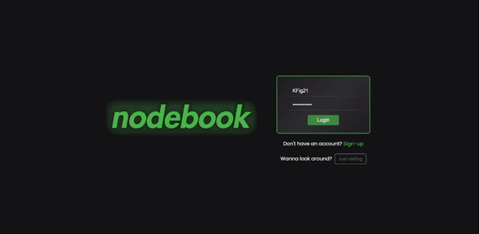

# nodebook_client

<a href="https://kfig21.github.io/nodebook_client/" target="_blank" rel="noopener noreferrer">View the project here!</a> 👀

Nodebook API repo - <a href="https://github.com/KFig21/nodebook_api" target="_blank" rel="noopener noreferrer">click here!</a>

<h3>Summary</h3>

This was the final project for <a href="https://www.theodinproject.com/paths/full-stack-javascript/courses/nodejs/lessons/odin-book" target="_blank" rel="noopener noreferrer">The Odin Project's</a> NodeJS curriculum. The goal of the project is to build/re-create a functional social media platform with a backend. This application is closely modeled after Facebook & Twitter.

 <h3>Technologies:</h3>
  <ul>
  <li><strong>M</strong>ongoDB</li>
  <li><strong>E</strong>xpress</li>
  <li><strong>R</strong>eactJS</li>
  <li><strong>N</strong>odeJS</li>
  <li>SASS</li>
  <li>Styled Components</li>
  <li>Amazon S3 Bucket</li> 
 </ul>

 <h3>Features:</h3>
 <ul>
  <li>Responsive design for desktop, mobile, and tablet.</li>
  <li>Styled components used to create multiple themes.</li>
  <li>MongoDB used as the database, Amazon S3 bucket used for images.</li>
  <li>Infinite scroll in timeline, all profile feeds, comments & followers/following/likers lists.</li>
  <li>Create a profile or use the test account (test account cannot edit the profile's info). Signup/Login/Logout authentication.</li>
  <li>Upload an avatar and cover picture with the ability to crop. Edit profile to include user info or update profile pictures.</li>
  <li>Post a message with or without an image and comment on other users posts.</li>
  <li>Like/Unlike posts and comments. View the likers of a post or comment.</li>
  <li>Notifications sent on like, comment, or follow. Notifications removed on dislike, deleted post, deleted comment, or unfollow.</li>
  <li>Posts and comments can be edited or deleted. Edited posts and comments display that they have been edited.</li>
 </ul>
 
<h3>Demo GIF</h3>

<h4>Desktop</h4>

<h4>Mobile</h4>

---

<h3>Thanks for checking out my project! Any && all feedback is appreciated!</h3>
